# 🧱 Base de Datos Local con Room y MVI

Este documento describe cómo implementar una base de datos local en una aplicación Android utilizando:

- **Room**: Para almacenamiento local de datos
- **Hilt**: Para la inyección de dependencias
- **MVI**: Para la arquitectura de presentación

## 📐 Diagrama de Arquitectura General


---

## 🔄 Flujo de Datos MVI

```mermaid
sequenceDiagram
    participant UI as UI (Compose)
    participant VM as ViewModel
    participant UC as UseCase
    participant Repo as Repository
    participant Room as Room DB

    Note over UI,Room: Crear Nueva Tarea
    
    rect rgb(129, 212, 250, 0.2)
    Note right of UI: 🎯 Capa de UI
    UI->>VM: TaskEvent.CrearTask
    VM->>VM: _state.update(userMessage)
    VM-->>UI: TaskUiState updated
    end
    
    rect rgb(255, 245, 157, 0.2)
    Note right of UC: 🧠 Capa de Dominio
    VM->>UC: createTask()
    end
    
    rect rgb(128, 203, 196, 0.2)
    Note right of Repo: 🧩 Capa de Datos
    UC->>Repo: createTask()
    Repo->>Room: upsert()
    Room-->>Repo: Success
    Repo-->>UC: Resource.Success
    UC-->>VM: Success
    end
    
    rect rgb(197, 225, 165, 0.2)
    Note right of Room: ✅ Actualización
    Room-->>UI: Flow actualizado
    end
```



---

## 🧩 Capa de Datos

### 🗃️ Room

```kotlin
@Entity(tableName = "tasks")
data class TaskEntity(
    @PrimaryKey val id: String = UUID.randomUUID().toString(),
    val descripcion: String,
    val tiempo: Int
)

@Dao
interface TaskDao {
    @Query("SELECT * FROM tasks") 
    fun observeTasks(): Flow<List<TaskEntity>>
    
    @Query("SELECT * FROM tasks WHERE id = :id") 
    suspend fun getTask(id: String): TaskEntity?
    
    @Upsert 
    suspend fun upsert(task: TaskEntity)
    
    @Query("DELETE FROM tasks WHERE id = :id") 
    suspend fun delete(id: String)
}

@Database(entities = [TaskEntity::class], version = 1)
abstract class TaskDatabase : RoomDatabase() {
    abstract fun taskDao(): TaskDao
}
```

---

### 🔄 Repositorio (Implementación)

```kotlin
class TaskRepositoryImpl @Inject constructor(
    private val localDataSource: TaskDao
) : TaskRepository {
    override fun observeTasks(): Flow<List<Task>> {
        return localDataSource.observeTasks().map { entities ->
            entities.map { it.toTask() }
        }
    }

    override suspend fun getTask(id: String): Task? {
        return localDataSource.getTask(id)?.toTask()
    }

    override suspend fun createTask(task: Task): Resource<Task> {
        return try {
            localDataSource.upsert(task.toEntity())
            Resource.Success(task)
        } catch (e: Exception) {
            Resource.Error(e.localizedMessage ?: "Error al crear tarea")
        }
    }

    override suspend fun updateTask(task: Task): Resource<Unit> {
        return try {
            localDataSource.upsert(task.toEntity())
            Resource.Success(Unit)
        } catch (e: Exception) {
            Resource.Error(e.localizedMessage ?: "Error al actualizar tarea")
        }
    }

    override suspend fun deleteTask(id: String): Resource<Unit> {
        return try {
            localDataSource.delete(id)
            Resource.Success(Unit)
        } catch (e: Exception) {
            Resource.Error(e.localizedMessage ?: "Error al eliminar tarea")
        }
    }
}

// Mappers
fun TaskEntity.toTask() = Task(
    id = id,
    descripcion = descripcion,
    tiempo = tiempo
)

fun Task.toEntity() = TaskEntity(
    id = id,
    descripcion = descripcion,
    tiempo = tiempo
)
```

---

## 🎯 Capa de Dominio

### 📋 Modelo de Dominio

```kotlin
data class Task(
    val id: String = UUID.randomUUID().toString(),
    val descripcion: String,
    val tiempo: Int
)
```

### 🔌 Repositorio (Interfaz)

```kotlin
interface TaskRepository {
    fun observeTasks(): Flow<List<Task>>
    suspend fun getTask(id: String): Task?
    suspend fun createTask(task: Task): Resource<Task>
    suspend fun updateTask(task: Task): Resource<Unit>
    suspend fun deleteTask(id: String): Resource<Unit>
}
```

### 🧪 Use Cases

```kotlin
class CreateTaskUseCase @Inject constructor(
    private val repo: TaskRepository
) {
    suspend operator fun invoke(task: Task): Resource<Task> = repo.createTask(task)
}

class UpdateTaskUseCase @Inject constructor(
    private val repo: TaskRepository
) {
    suspend operator fun invoke(task: Task): Resource<Unit> = repo.updateTask(task)
}

class DeleteTaskUseCase @Inject constructor(
    private val repo: TaskRepository
) {
    suspend operator fun invoke(id: String): Resource<Unit> = repo.deleteTask(id)
}

class ObserveTasksUseCase @Inject constructor(
    private val repo: TaskRepository
) {
    operator fun invoke(): Flow<List<Task>> = repo.observeTasks()
}
```

---

## 🎯 Capa de Presentación

### 🎨 Patrón MVI - Flujo Unidireccional

```mermaid
graph LR
    subgraph "Compose UI"
        Screen[TaskListScreen]
        Body[TaskListBody]
    end
    
    subgraph "ViewModel"
        State[TaskUiState]
        Event[TaskEvent]
        Logic[Business Logic]
    end
    
    Body -->|"Interacción Usuario"| Event
    Event -->|"onEvent()"| Logic
    Logic -->|"_state.update()"| State
    State -->|"collectAsStateWithLifecycle()"| Body
    
    Logic -.->|"suspend fun"| UC[Use Cases]
    
    %% Estilos consistentes con el resto
    style Screen fill:#81d4fa,stroke:#0288d1,stroke-width:2px,color:#212121
    style Body fill:#81d4fa,stroke:#0288d1,stroke-width:2px,color:#212121
    style Event fill:#ffe082,stroke:#ffb300,stroke-width:2px,color:#212121
    style Logic fill:#81d4fa,stroke:#0288d1,stroke-width:2px,color:#212121
    style State fill:#c5e1a5,stroke:#558b2f,stroke-width:2px,color:#212121
    style UC fill:#fff59d,stroke:#f9a825,stroke-width:2px,color:#212121
```



### 📬 TaskEvent.kt

```kotlin
sealed interface TaskEvent {
    data class CrearTask(val descripcion: String, val tiempo: Int) : TaskEvent
    data class UpdateTask(val task: Task) : TaskEvent
    data class DeleteTask(val id: String) : TaskEvent
    object ShowCreateSheet : TaskEvent
    object HideCreateSheet : TaskEvent
    data class OnDescriptionChange(val description: String) : TaskEvent
    data class OnTimeChange(val time: Int) : TaskEvent
    object UserMessageShown : TaskEvent
}
```

### 📊 TaskUiState.kt

```kotlin
data class TaskUiState(
    val isLoading: Boolean = false,
    val tasks: List<Task> = emptyList(),
    val userMessage: String? = null,
    val showCreateSheet: Boolean = false,
    val taskDescription: String = "",
    val taskTime: Int = 0
)
```

### 🎮 TaskViewModel.kt

```kotlin
@HiltViewModel
class TaskViewModel @Inject constructor(
    private val createTaskUseCase: CreateTaskUseCase,
    private val updateTaskUseCase: UpdateTaskUseCase,
    private val deleteTaskUseCase: DeleteTaskUseCase,
    private val observeTasksUseCase: ObserveTasksUseCase
) : ViewModel() {

    private val _state = MutableStateFlow(TaskUiState(isLoading = true))
    val state: StateFlow<TaskUiState> = _state.asStateFlow()

    init {
        observeTasks()
    }

    private fun observeTasks() {
        viewModelScope.launch {
            observeTasksUseCase()
                .catch { e ->
                    _state.update { 
                        it.copy(
                            isLoading = false,
                            userMessage = e.localizedMessage ?: "Error al cargar tareas"
                        ) 
                    }
                }
                .collect { tasks ->
                    _state.update { 
                        it.copy(
                            isLoading = false,
                            tasks = tasks
                        ) 
                    }
                }
        }
    }

    fun onEvent(event: TaskEvent) {
        when (event) {
            is TaskEvent.CrearTask -> crearTask(event.descripcion, event.tiempo)
            is TaskEvent.UpdateTask -> updateTask(event.task)
            is TaskEvent.DeleteTask -> deleteTask(event.id)
            is TaskEvent.ShowCreateSheet -> _state.update { it.copy(showCreateSheet = true) }
            is TaskEvent.HideCreateSheet -> _state.update { 
                it.copy(
                    showCreateSheet = false, 
                    taskDescription = "",
                    taskTime = 0
                ) 
            }
            is TaskEvent.OnDescriptionChange -> _state.update { 
                it.copy(taskDescription = event.description) 
            }
            is TaskEvent.OnTimeChange -> _state.update { 
                it.copy(taskTime = event.time) 
            }
            is TaskEvent.UserMessageShown -> clearMessage()
        }
    }

    private fun crearTask(desc: String, tiempo: Int) = viewModelScope.launch {
        val task = Task(descripcion = desc, tiempo = tiempo)
        when (val result = createTaskUseCase(task)) {
            is Resource.Success -> {
                _state.update { 
                    it.copy(
                        userMessage = "Tarea guardada",
                        showCreateSheet = false,
                        taskDescription = "",
                        taskTime = 0
                    ) 
                }
            }
            is Resource.Error -> _state.update { 
                it.copy(userMessage = result.message) 
            }
            else -> {}
        }
    }

    private fun updateTask(task: Task) = viewModelScope.launch {
        when (val result = updateTaskUseCase(task)) {
            is Resource.Success -> _state.update { 
                it.copy(userMessage = "Tarea actualizada") 
            }
            is Resource.Error -> _state.update { 
                it.copy(userMessage = result.message) 
            }
            else -> {}
        }
    }

    private fun deleteTask(id: String) = viewModelScope.launch {
        when (val result = deleteTaskUseCase(id)) {
            is Resource.Success -> _state.update { 
                it.copy(userMessage = "Tarea eliminada") 
            }
            is Resource.Error -> _state.update { 
                it.copy(userMessage = result.message) 
            }
            else -> {}
        }
    }

    private fun clearMessage() {
        _state.update { it.copy(userMessage = null) }
    }
}
```

### 📱 TaskListScreen.kt

```kotlin
@Composable
fun TaskListScreen(
    viewModel: TaskViewModel = hiltViewModel()
) {
    val state by viewModel.state.collectAsStateWithLifecycle()
    TaskListBody(state, viewModel::onEvent)
}

@OptIn(ExperimentalMaterial3Api::class)
@Composable
fun TaskListBody(
    state: TaskUiState,
    onEvent: (TaskEvent) -> Unit
) {
    val sheetState = rememberModalBottomSheetState()
    val snackbarHostState = remember { SnackbarHostState() }

    LaunchedEffect(state.userMessage) {
        state.userMessage?.let { message ->
            snackbarHostState.showSnackbar(message)
            onEvent(TaskEvent.UserMessageShown)
        }
    }

    Scaffold(
        snackbarHost = { SnackbarHost(snackbarHostState) },
        floatingActionButton = {
            FloatingActionButton(
                onClick = { onEvent(TaskEvent.ShowCreateSheet) },
                modifier = Modifier.testTag("fab_add")
            ) {
                Icon(
                    imageVector = Icons.Default.Add,
                    contentDescription = "Agregar tarea"
                )
            }
        }
    ) { padding ->
        Box(
            modifier = Modifier
                .padding(padding)
                .fillMaxSize()
        ) {
            if (state.isLoading) {
                CircularProgressIndicator(
                    modifier = Modifier
                        .align(Alignment.Center)
                        .testTag("loading")
                )
            } else {
                if (state.tasks.isEmpty()) {
                    Text(
                        text = "No hay tareas",
                        modifier = Modifier
                            .align(Alignment.Center)
                            .testTag("empty_message"),
                        style = MaterialTheme.typography.bodyLarge
                    )
                } else {
                    LazyColumn(
                        modifier = Modifier.fillMaxSize(),
                        contentPadding = PaddingValues(16.dp),
                        verticalArrangement = Arrangement.spacedBy(8.dp)
                    ) {
                        items(
                            items = state.tasks,
                            key = { it.id }
                        ) { task ->
                            TaskItem(
                                task = task,
                                onDelete = {
                                    onEvent(TaskEvent.DeleteTask(task.id))
                                }
                            )
                        }
                    }
                }
            }
        }

        if (state.showCreateSheet) {
            ModalBottomSheet(
                onDismissRequest = { onEvent(TaskEvent.HideCreateSheet) },
                sheetState = sheetState
            ) {
                Column(
                    modifier = Modifier
                        .fillMaxWidth()
                        .padding(16.dp)
                        .navigationBarsPadding()
                        .imePadding(),
                    verticalArrangement = Arrangement.spacedBy(16.dp)
                ) {
                    Text(
                        text = "Nueva Tarea",
                        style = MaterialTheme.typography.headlineSmall
                    )

                    OutlinedTextField(
                        value = state.taskDescription,
                        onValueChange = { onEvent(TaskEvent.OnDescriptionChange(it)) },
                        label = { Text("Descripción") },
                        modifier = Modifier
                            .fillMaxWidth()
                            .testTag("input_description"),
                        singleLine = false,
                        minLines = 3,
                        maxLines = 5
                    )

                    OutlinedTextField(
                        value = state.taskTime.toString(),
                        onValueChange = { 
                            it.toIntOrNull()?.let { time ->
                                onEvent(TaskEvent.OnTimeChange(time))
                            }
                        },
                        label = { Text("Tiempo (minutos)") },
                        modifier = Modifier
                            .fillMaxWidth()
                            .testTag("input_time"),
                        keyboardOptions = KeyboardOptions(keyboardType = KeyboardType.Number),
                        singleLine = true
                    )

                    Row(
                        modifier = Modifier.fillMaxWidth(),
                        horizontalArrangement = Arrangement.spacedBy(8.dp)
                    ) {
                        OutlinedButton(
                            onClick = { onEvent(TaskEvent.HideCreateSheet) },
                            modifier = Modifier.weight(1f)
                        ) {
                            Text("Cancelar")
                        }

                        Button(
                            onClick = {
                                if (state.taskDescription.isNotBlank()) {
                                    onEvent(TaskEvent.CrearTask(state.taskDescription, state.taskTime))
                                }
                            },
                            modifier = Modifier
                                .weight(1f)
                                .testTag("btn_save"),
                            enabled = state.taskDescription.isNotBlank()
                        ) {
                            Text("Guardar")
                        }
                    }
                }
            }
        }
    }
}

@Composable
fun TaskItem(
    task: Task,
    onDelete: () -> Unit
) {
    ElevatedCard(
        modifier = Modifier
            .fillMaxWidth()
            .testTag("task_item_${task.id}")
    ) {
        Row(
            modifier = Modifier
                .fillMaxWidth()
                .padding(16.dp),
            verticalAlignment = Alignment.CenterVertically
        ) {
            Column(
                modifier = Modifier.weight(1f)
            ) {
                Text(
                    text = task.descripcion,
                    style = MaterialTheme.typography.bodyLarge
                )

                Text(
                    text = "${task.tiempo} min",
                    style = MaterialTheme.typography.bodyMedium,
                    color = MaterialTheme.colorScheme.primary
                )
            }

            IconButton(
                onClick = onDelete,
                modifier = Modifier.testTag("btn_delete_${task.id}")
            ) {
                Icon(
                    imageVector = Icons.Default.Delete,
                    contentDescription = "Eliminar tarea"
                )
            }
        }
    }
}

@Preview(showBackground = true)
@Composable
private fun TaskListBodyPreview() {
    MaterialTheme {
        val state = TaskUiState(
            isLoading = false,
            tasks = listOf(
                Task(
                    id = "1",
                    descripcion = "Tarea urgente",
                    tiempo = 30
                ),
                Task(
                    id = "2",
                    descripcion = "Tarea normal",
                    tiempo = 45
                ),
                Task(
                    id = "3",
                    descripcion = "Tarea larga",
                    tiempo = 60
                )
            )
        )
        TaskListBody(state) {}
    }
}
```

---

## 🔧 Configuración de Hilt

### 📦 Módulo de Database

```kotlin
@Module
@InstallIn(SingletonComponent::class)
object DatabaseModule {

    @Provides
    @Singleton
    fun provideTaskDatabase(
        @ApplicationContext context: Context
    ): TaskDatabase {
        return Room.databaseBuilder(
            context,
            TaskDatabase::class.java,
            "task_database"
        ).build()
    }

    @Provides
    @Singleton
    fun provideTaskDao(database: TaskDatabase): TaskDao {
        return database.taskDao()
    }
}
```

### 🔌 Módulo de Repository

```kotlin
@Module
@InstallIn(SingletonComponent::class)
abstract class RepositoryModule {

    @Binds
    @Singleton
    abstract fun bindTaskRepository(
        impl: TaskRepositoryImpl
    ): TaskRepository
}
```

---

## 🧪 Testing

### 📦 Dependencias de Testing

```kotlin
dependencies {
    // Unit Testing
    testImplementation("junit:junit:4.13.2")
    testImplementation("org.jetbrains.kotlinx:kotlinx-coroutines-test:1.7.3")
    testImplementation("io.mockk:mockk:1.13.8")
    testImplementation("androidx.arch.core:core-testing:2.2.0")
    
    // Android Instrumented Testing
    androidTestImplementation("androidx.test.ext:junit:1.1.5")
    androidTestImplementation("androidx.test.espresso:espresso-core:3.5.1")
    
    // Compose Testing
    androidTestImplementation("androidx.compose.ui:ui-test-junit4:1.5.4")
    debugImplementation("androidx.compose.ui:ui-test-manifest:1.5.4")
    
    // Hilt Testing
    testImplementation("com.google.dagger:hilt-android-testing:2.48")
    kspTest("com.google.dagger:hilt-android-compiler:2.48")
    androidTestImplementation("com.google.dagger:hilt-android-testing:2.48")
    kspAndroidTest("com.google.dagger:hilt-android-compiler:2.48")
    
    // Room Testing
    testImplementation("androidx.room:room-testing:2.6.0")
}
```

---

### 🧩 Tests de Capa de Datos

#### TaskRepositoryImplTest.kt

```kotlin
@ExperimentalCoroutinesApi
class TaskRepositoryImplTest {

    @get:Rule
    val instantExecutorRule = InstantTaskExecutorRule()

    private lateinit var repository: TaskRepositoryImpl
    private lateinit var localDataSource: TaskDao

    @Before
    fun setup() {
        localDataSource = mockk(relaxed = true)
        repository = TaskRepositoryImpl(localDataSource)
    }

    @Test
    fun `createTask guarda tarea correctamente`() = runTest {
        // Given
        val task = Task(
            id = "1",
            descripcion = "Nueva tarea",
            tiempo = 30
        )
        val taskSlot = slot<TaskEntity>()
        coEvery { localDataSource.upsert(capture(taskSlot)) } just Runs

        // When
        val result = repository.createTask(task)

        // Then
        assertTrue(result is Resource.Success)
        coVerify { localDataSource.upsert(any()) }
        assertEquals("Nueva tarea", taskSlot.captured.descripcion)
        assertEquals(30, taskSlot.captured.tiempo)
    }

    @Test
    fun `updateTask actualiza tarea correctamente`() = runTest {
        // Given
        val task = Task(id = "1", descripcion = "Tarea actualizada", tiempo = 45)
        coEvery { localDataSource.upsert(any()) } just Runs

        // When
        val result = repository.updateTask(task)

        // Then
        assertTrue(result is Resource.Success)
        coVerify { localDataSource.upsert(any()) }
    }

    @Test
    fun `deleteTask elimina tarea correctamente`() = runTest {
        // Given
        val taskId = "1"
        coEvery { localDataSource.delete(taskId) } just Runs

        // When
        val result = repository.deleteTask(taskId)

        // Then
        assertTrue(result is Resource.Success)
        coVerify { localDataSource.delete(taskId) }
    }

    @Test
    fun `observeTasks retorna flow de tareas`() = runTest {
        // Given
        val entities = listOf(
            TaskEntity("1", "Tarea 1", 30),
            TaskEntity("2", "Tarea 2", 45)
        )
        every { localDataSource.observeTasks() } returns flowOf(entities)

        // When
        val result = repository.observeTasks().first()

        // Then
        assertEquals(2, result.size)
        assertEquals("Tarea 1", result[0].descripcion)
        assertEquals("Tarea 2", result[1].descripcion)
    }
}
```

---

### 🎯 Tests de Capa de Dominio

#### CreateTaskUseCaseTest.kt

```kotlin
@ExperimentalCoroutinesApi
class CreateTaskUseCaseTest {

    private lateinit var useCase: CreateTaskUseCase
    private lateinit var repository: TaskRepository

    @Before
    fun setup() {
        repository = mockk()
        useCase = CreateTaskUseCase(repository)
    }

    @Test
    fun `invoke llama al repositorio correctamente`() = runTest {
        // Given
        val task = Task(descripcion = "Test task", tiempo = 30)
        coEvery { repository.createTask(task) } returns Resource.Success(task)

        // When
        val result = useCase(task)

        // Then
        assertTrue(result is Resource.Success)
        assertEquals(task, (result as Resource.Success).data)
        coVerify { repository.createTask(task) }
    }

    @Test
    fun `invoke propaga errores del repositorio`() = runTest {
        // Given
        val task = Task(descripcion = "Test task", tiempo = 30)
        val errorMessage = "Database error"
        coEvery { repository.createTask(task) } returns Resource.Error(errorMessage)

        // When
        val result = useCase(task)

        // Then
        assertTrue(result is Resource.Error)
        assertEquals(errorMessage, (result as Resource.Error).message)
    }
}
```

---

### 🎨 Tests de Capa de Presentación

#### TaskViewModelTest.kt

```kotlin
@ExperimentalCoroutinesApi
class TaskViewModelTest {

    @get:Rule
    val instantExecutorRule = InstantTaskExecutorRule()

    @get:Rule
    val mainDispatcherRule = MainDispatcherRule()

    private lateinit var viewModel: TaskViewModel
    private lateinit var createTaskUseCase: CreateTaskUseCase
    private lateinit var updateTaskUseCase: UpdateTaskUseCase
    private lateinit var deleteTaskUseCase: DeleteTaskUseCase
    private lateinit var observeTasksUseCase: ObserveTasksUseCase

    @Before
    fun setup() {
        createTaskUseCase = mockk()
        updateTaskUseCase = mockk()
        deleteTaskUseCase = mockk()
        observeTasksUseCase = mockk()
        
        every { observeTasksUseCase() } returns flowOf(emptyList())
        
        viewModel = TaskViewModel(
            createTaskUseCase,
            updateTaskUseCase,
            deleteTaskUseCase,
            observeTasksUseCase
        )
    }

    @Test
    fun `onEvent ShowCreateSheet actualiza estado correctamente`() {
        // When
        viewModel.onEvent(TaskEvent.ShowCreateSheet)

        // Then
        assertTrue(viewModel.state.value.showCreateSheet)
    }

    @Test
    fun `onEvent HideCreateSheet limpia campos y cierra sheet`() {
        // Given
        viewModel.onEvent(TaskEvent.ShowCreateSheet)
        viewModel.onEvent(TaskEvent.OnDescriptionChange("Test"))
        viewModel.onEvent(TaskEvent.OnTimeChange(30))

        // When
        viewModel.onEvent(TaskEvent.HideCreateSheet)

        // Then
        assertFalse(viewModel.state.value.showCreateSheet)
        assertEquals("", viewModel.state.value.taskDescription)
        assertEquals(0, viewModel.state.value.taskTime)
    }

    @Test
    fun `onEvent CrearTask crea tarea y cierra sheet cuando es exitoso`() = runTest {
        // Given
        val descripcion = "Nueva tarea"
        val tiempo = 30
        val task = Task(descripcion = descripcion, tiempo = tiempo)
        coEvery { createTaskUseCase(any()) } returns Resource.Success(task)

        // When
        viewModel.onEvent(TaskEvent.CrearTask(descripcion, tiempo))
        advanceUntilIdle()

        // Then
        assertFalse(viewModel.state.value.showCreateSheet)
        assertEquals("", viewModel.state.value.taskDescription)
        assertEquals(0, viewModel.state.value.taskTime)
        assertEquals("Tarea guardada", viewModel.state.value.userMessage)
        coVerify { createTaskUseCase(any()) }
    }

    @Test
    fun `onEvent CrearTask muestra error cuando falla`() = runTest {
        // Given
        val descripcion = "Nueva tarea"
        val tiempo = 30
        val errorMessage = "Error de base de datos"
        coEvery { createTaskUseCase(any()) } returns Resource.Error(errorMessage)

        // When
        viewModel.onEvent(TaskEvent.CrearTask(descripcion, tiempo))
        advanceUntilIdle()

        // Then
        assertEquals(errorMessage, viewModel.state.value.userMessage)
    }

    @Test
    fun `observeTasks carga tareas correctamente`() = runTest {
        // Given
        val tasks = listOf(
            Task("1", "Tarea 1", 30),
            Task("2", "Tarea 2", 45)
        )
        every { observeTasksUseCase() } returns flowOf(tasks)

        // When
        viewModel = TaskViewModel(
            createTaskUseCase,
            updateTaskUseCase,
            deleteTaskUseCase,
            observeTasksUseCase
        )
        advanceUntilIdle()

        // Then
        assertFalse(viewModel.state.value.isLoading)
        assertEquals(2, viewModel.state.value.tasks.size)
        assertEquals("Tarea 1", viewModel.state.value.tasks[0].descripcion)
    }
}

// Regla para el Dispatcher Main en tests
@ExperimentalCoroutinesApi
class MainDispatcherRule(
    private val testDispatcher: TestDispatcher = UnconfinedTestDispatcher()
) : TestWatcher() {
    override fun starting(description: Description) {
        Dispatchers.setMain(testDispatcher)
    }

    override fun finished(description: Description) {
        Dispatchers.resetMain()
    }
}
```

---

#### TaskListScreenTest.kt (UI Test con Compose)

```kotlin
@ExperimentalMaterial3Api
class TaskListScreenTest {

    @get:Rule
    val composeTestRule = createComposeRule()

    @Test
    fun taskListBody_muestra_loading_cuando_isLoading_es_true() {
        // Given
        val state = TaskUiState(isLoading = true)

        // When
        composeTestRule.setContent {
            MaterialTheme {
                TaskListBody(state = state, onEvent = {})
            }
        }

        // Then
        composeTestRule.onNodeWithTag("loading").assertIsDisplayed()
    }

    @Test
    fun taskListBody_muestra_mensaje_vacio_cuando_no_hay_tareas() {
        // Given
        val state = TaskUiState(isLoading = false, tasks = emptyList())

        // When
        composeTestRule.setContent {
            MaterialTheme {
                TaskListBody(state = state, onEvent = {})
            }
        }

        // Then
        composeTestRule.onNodeWithTag("empty_message").assertIsDisplayed()
        composeTestRule.onNodeWithText("No hay tareas").assertIsDisplayed()
    }

    @Test
    fun taskListBody_muestra_lista_de_tareas() {
        // Given
        val tasks = listOf(
            Task(id = "1", descripcion = "Tarea 1", tiempo = 30),
            Task(id = "2", descripcion = "Tarea 2", tiempo = 45)
        )
        val state = TaskUiState(isLoading = false, tasks = tasks)

        // When
        composeTestRule.setContent {
            MaterialTheme {
                TaskListBody(state = state, onEvent = {})
            }
        }

        // Then
        composeTestRule.onNodeWithText("Tarea 1").assertIsDisplayed()
        composeTestRule.onNodeWithText("Tarea 2").assertIsDisplayed()
    }

    @Test
    fun fab_dispara_evento_ShowCreateSheet() {
        // Given
        val state = TaskUiState(isLoading = false)
        var eventReceived: TaskEvent? = null

        // When
        composeTestRule.setContent {
            MaterialTheme {
                TaskListBody(
                    state = state,
                    onEvent = { eventReceived = it }
                )
            }
        }
        composeTestRule.onNodeWithTag("fab_add").performClick()

        // Then
        assertTrue(eventReceived is TaskEvent.ShowCreateSheet)
    }

    @Test
    fun boton_eliminar_dispara_evento_DeleteTask() {
        // Given
        val task = Task(id = "1", descripcion = "Test", tiempo = 30)
        val state = TaskUiState(isLoading = false, tasks = listOf(task))
        var eventReceived: TaskEvent? = null

        // When
        composeTestRule.setContent {
            MaterialTheme {
                TaskListBody(
                    state = state,
                    onEvent = { eventReceived = it }
                )
            }
        }
        composeTestRule.onNodeWithTag("btn_delete_1").performClick()

        // Then
        assertTrue(eventReceived is TaskEvent.DeleteTask)
        assertEquals("1", (eventReceived as TaskEvent.DeleteTask).id)
    }

    @Test
    fun bottomSheet_muestra_y_permite_escribir_descripcion() {
        // Given
        val state = TaskUiState(
            isLoading = false,
            showCreateSheet = true,
            taskDescription = ""
        )
        var lastDescription = ""

        // When
        composeTestRule.setContent {
            MaterialTheme {
                TaskListBody(
                    state = state,
                    onEvent = { 
                        if (it is TaskEvent.OnDescriptionChange) {
                            lastDescription = it.description
                        }
                    }
                )
            }
        }
        
        composeTestRule.onNodeWithTag("input_description")
            .performTextInput("Nueva tarea de prueba")

        // Then
        assertEquals("Nueva tarea de prueba", lastDescription)
    }

    @Test
    fun boton_guardar_esta_deshabilitado_cuando_descripcion_esta_vacia() {
        // Given
        val state = TaskUiState(
            isLoading = false,
            showCreateSheet = true,
            taskDescription = ""
        )

        // When
        composeTestRule.setContent {
            MaterialTheme {
                TaskListBody(state = state, onEvent = {})
            }
        }

        // Then
        composeTestRule.onNodeWithTag("btn_save").assertIsNotEnabled()
    }
}
```

---

## 📦 Dependencias en `build.gradle.kts`

```kotlin
dependencies {
    // Room
    implementation("androidx.room:room-runtime:2.6.0")
    implementation("androidx.room:room-ktx:2.6.0")
    ksp("androidx.room:room-compiler:2.6.0")
    
    // Hilt
    implementation("com.google.dagger:hilt-android:2.48")
    ksp("com.google.dagger:hilt-android-compiler:2.48")
    
    // Coroutines
    implementation("org.jetbrains.kotlinx:kotlinx-coroutines-android:1.7.3")
    implementation("org.jetbrains.kotlinx:kotlinx-coroutines-core:1.7.3")
    
    // Lifecycle
    implementation("androidx.lifecycle:lifecycle-viewmodel-ktx:2.6.2")
    implementation("androidx.lifecycle:lifecycle-runtime-ktx:2.6.2")
    implementation("androidx.lifecycle:lifecycle-runtime-compose:2.6.2")
}
```

---

## 🚀 Ventajas de esta Arquitectura

1. **Separación de capas**: Cada capa tiene una responsabilidad clara
2. **Testeable**: Todas las capas son fáciles de testear de forma aislada
3. **Reactivo**: Uso de Flow para actualizaciones automáticas de UI
4. **MVI**: Flujo unidireccional de datos que hace el código predecible
5. **Inyección de dependencias**: Hilt facilita la gestión de dependencias
6. **Persistencia local**: Room proporciona una capa robusta para SQLite

---

## ✅ Resource Sealed Class

```kotlin
sealed class Resource<T>(
    val data: T? = null,
    val message: String? = null
) {
    class Success<T>(data: T) : Resource<T>(data)
    class Error<T>(message: String, data: T? = null) : Resource<T>(data, message)
    class Loading<T>(data: T? = null) : Resource<T>(data)
}
```
