# 🧱 Base de Datos Local con Room y MVI

Este documento describe cómo implementar una base de datos local en una aplicación Android utilizando:

- **Room**: Para almacenamiento local de datos
- **Hilt**: Para la inyección de dependencias
- **MVI**: Para la arquitectura de presentación

## 📐 Diagrama de Arquitectura General

```mermaid
graph TB
    subgraph "🎯 Capa de UI"
        Screen[TaskListScreen]
        VM[TaskViewModel]
        State[TaskUiState]
        Event[TaskEvent]
    end
    
    subgraph "🧠 Capa de Dominio"
        UC[Use Cases]
        Repo[TaskRepository Interface]
        Model[Task Model]
    end
    
    subgraph "🧩 Capa de Datos"
        RepoImpl[TaskRepositoryImpl]
        Room[(Room Database)]
    end
    
    Screen --> VM
    VM --> Event
    VM --> State
    VM --> UC
    UC --> Repo
    Repo -.implementa.-> RepoImpl
    RepoImpl --> Room
    Room -.->|observa Flow| RepoImpl
    
    %% Estilos por capa
    style Screen fill:#81d4fa,stroke:#0288d1,stroke-width:2px,color:#212121
    style VM fill:#81d4fa,stroke:#0288d1,stroke-width:2px,color:#212121
    style State fill:#81d4fa,stroke:#0288d1,stroke-width:2px,color:#212121
    style Event fill:#ffe082,stroke:#ffb300,stroke-width:2px,color:#212121
    
    style UC fill:#fff59d,stroke:#f9a825,stroke-width:2px,color:#212121
    style Repo fill:#fff59d,stroke:#f9a825,stroke-width:2px,color:#212121
    style Model fill:#fff59d,stroke:#f9a825,stroke-width:2px,color:#212121
    
    style RepoImpl fill:#80cbc4,stroke:#388e3c,stroke-width:2px,color:#212121
    style Room fill:#80cbc4,stroke:#388e3c,stroke-width:2px,color:#212121
```



---

## 🔄 Flujo de Datos MVI

### Flujo de Guardado de Tarea

```mermaid
sequenceDiagram
    participant UI as TaskFormScreen
    participant VM as TaskFormViewModel
    participant UC as UpsertTaskUseCase
    participant Repo as TaskRepository
    participant Room as Room DB

    Note over UI,Room: Guardar/Actualizar Tarea
    
    rect rgb(129, 212, 250, 0.2)
    Note right of UI: 🎯 Capa de UI
    UI->>VM: TaskFormUiEvent.Save
    VM->>VM: Validar campos
    VM->>VM: _state.update(isSaving=true)
    end
    
    rect rgb(255, 245, 157, 0.2)
    Note right of UC: 🧠 Capa de Dominio
    VM->>UC: invoke(task)
    UC->>UC: validateDescripcion()
    UC->>UC: validateTiempo()
    end
    
    rect rgb(128, 203, 196, 0.2)
    Note right of Repo: 🧩 Capa de Datos
    UC->>Repo: upsert(task)
    Repo->>Room: upsert(entity)
    Room-->>Repo: Success
    Repo-->>UC: Int (tareaId)
    UC-->>VM: Result.success(tareaId)
    end
    
    rect rgb(129, 212, 250, 0.2)
    VM->>VM: _state.update(saved=true)
    VM-->>UI: TaskFormUiState actualizado
    end
```



### Flujo de Observación de Tareas


### Flujo de Eliminación de Tarea

```mermaid
sequenceDiagram
    participant UI as TaskListScreen
    participant VM as TaskListViewModel
    participant UC as DeleteTaskUseCase
    participant Repo as TaskRepository
    participant Room as Room DB

    Note over UI,Room: Eliminar Tarea
    
    rect rgb(129, 212, 250, 0.2)
    Note right of UI: 🎯 Capa de UI
    UI->>VM: TaskListUiEvent.Delete(id)
    end
    
    rect rgb(255, 245, 157, 0.2)
    Note right of UC: 🧠 Capa de Dominio
    VM->>UC: invoke(id)
    UC->>Repo: delete(id)
    end
    
    rect rgb(128, 203, 196, 0.2)
    Note right of Repo: 🧩 Capa de Datos
    Repo->>Room: deleteById(id)
    Room-->>Repo: Unit
    Repo-->>UC: Unit
    end
    
    rect rgb(255, 245, 157, 0.2)
    UC-->>VM: Unit
    end
    
    rect rgb(129, 212, 250, 0.2)
    VM->>VM: _state.update(message="Eliminado")
    VM-->>UI: TaskListUiState actualizado
    end
    
    rect rgb(197, 225, 165, 0.2)
    Note over Room,UI: ✅ Flow notifica cambios
    Room->>UI: Lista actualizada automáticamente
    end
```



---
---
## 📁 Organizacion del Proyecto
```text
composedemo/
├── 💾 data/
│   └── 📋 tareas/
│       ├── 🗄️ local/
│       │   ├── TaskDao.kt
│       │   └── TaskEntity.kt
│       ├── 🔄 mapper/
│       │   └── TaskMapper.kt
│       └── 📦 repository/
│           └── TaskRepositoryImpl.kt
├── 💉 di/
│   ├── AppModule.kt
│   
├── 🎯 domain/
│   └── 📋 tareas/
│       ├── 📝 model/
│       │   └── Task.kt ⭐ (Modelo de dominio principal)
│       ├── 🔌 repository/
│       │   └── TaskRepository.kt
│       └── ⚙️ usecase/
│           ├── ❌ DeleteTaskUseCase.kt
│           ├── 🔍 GetTaskUseCase.kt
│           ├── 👀 ObserveTasksUseCase.kt
│           └── 💾 UpsertTaskUseCase.kt
└── 🎨 presentation/
    └── 📋 tareas/
        ├── ✏️ edit/
        │   ├── 📱 EditTaskScreen.kt
        │   ├── 🎬 EditTaskUiEvent.kt
        │   ├── 📊 EditTaskUiState.kt
        │   └── 🧠 EditTaskViewModel.kt
        └── 📜 list/
            ├── 📱 ListTaskScreen.kt
            ├── 🎬 ListTaskUiEvent.kt
            ├── 📊 ListTaskUiState.kt
            └── 🧠 ListTaskViewModel.kt

```
---
## 🧩 Capa de Datos

### 🗃️ Room

```kotlin
@Entity(tableName = "tasks")
data class TaskEntity(
    @PrimaryKey(autoGenerate = true)
    val tareaId: Int = 0,
    val descripcion: String,
    val tiempo: Int
)

@Dao
interface TaskDao { 
    @Upsert
    suspend fun upsert(entity: TaskEntity)
     
    @Delete
    suspend fun delete(entity: TaskEntity)
    
    @Query("SELECT * FROM tasks ORDER BY tareaId DESC")
    fun observeAll(): Flow<List<TaskEntity>>
    
    @Query("SELECT * FROM tasks WHERE tareaId = :id")
    suspend fun getById(id: Int): TaskEntity?
    
    @Query("DELETE FROM tasks WHERE tareaId = :id")
    suspend fun deleteById(id: Int)
    
    @Query("SELECT EXISTS(SELECT 1 FROM tasks WHERE tareaId = :id)")
    suspend fun exists(id: Int): Boolean
}

@Database(
    entities = [TaskEntity::class], 
    version = 1
)
abstract class TaskDatabase : RoomDatabase() {
    abstract fun taskDao(): TaskDao
}
```

---

### 🔄 Repositorio (Implementación)

```kotlin
class TaskRepositoryImpl @Inject constructor(
    private val localDataSource: TaskDao
) : TaskRepository {
    override fun observeTasks(): Flow<List<Task>> {
        return localDataSource.observeAll().map { entities ->
            entities.map { it.toDomain() }
        }
    }
    
    override suspend fun getTask(id: Int): Task? {
        return localDataSource.getById(id)?.toDomain()
    }
    
    override suspend fun upsert(task: Task): Int {
        localDataSource.upsert(task.toEntity())
        return task.tareaId ?: 0
    }
    
    override suspend fun delete(id: Int) {
        localDataSource.deleteById(id)
    }

    override suspend fun exists(id: Int): Boolean {
        return localDataSource.exists(id)
    }
}


// Mappers
fun TaskEntity.toDomain(): Task = Task(
    tareaId = tareaId,
    descripcion = descripcion,
    tiempo = tiempo
)

fun Task.toEntity(): TaskEntity = TaskEntity(
    tareaId = tareaId,
    descripcion = descripcion,
    tiempo = tiempo
)
```

---

## 🎯 Capa de Dominio

### 📋 Modelo de Dominio

```kotlin
data class Task(
    val tareaId: Int = 0,
    val descripcion: String,
    val tiempo: Int
)
```

### 🔌 Repositorio (Interfaz)

```kotlin
interface TaskRepository {
    fun observeTasks(): Flow<List<Task>>
    suspend fun getTask(id: Int): Task?
    suspend fun upsert(task: Task): Int
    suspend fun delete(id: Int)
    suspend fun exists(id: Int): Boolean 
}
```

### 🧪 Use Cases

```kotlin
class UpsertTaskUseCase(
    private val repository: TaskRepository
) {
    suspend operator fun invoke(task: Task): Result<Int> {
        val descriptionResult = validateDescripcion(task.descripcion)
        if (!descriptionResult.isValid) {
            return Result.failure(IllegalArgumentException(descriptionResult.error))
        }
        val tiempoResult = validateTiempo(task.tiempo.toString())
        if (!tiempoResult.isValid) {
            return Result.failure(IllegalArgumentException(tiempoResult.error))
        }
        return runCatching { repository.upsert(task) }
    }
}

class DeleteTaskUseCase(
    private val repository: TaskRepository
) {
    suspend operator fun invoke(id: Int) = repository.delete(id)
}

class GetTaskUseCase(
    private val repository: TaskRepository
) {
    suspend operator fun invoke(id: Int): Task? = repository.getTask(id)
}

class ObserveTasksUseCase(
    private val repository: TaskRepository
) {
    operator fun invoke(): Flow<List<Task>> = repository.observeTasks()
}
```

---

## 🎯 Capa de Presentación

### 🎨 Patrón MVI - Flujo Unidireccional


### LISTA

#### ⚡ TaskListUiEvent.kt

```kotlin
sealed class TaskListUiEvent {
    object Load : TaskListUiEvent()
    object Refresh : TaskListUiEvent()
    data class Delete(val id: Int) : TaskListUiEvent()
    data class ShowMessage(val message: String) : TaskListUiEvent()
    object ClearMessage : TaskListUiEvent()
    object CreateNew : TaskListUiEvent()
    data class Edit(val id: Int) : TaskListUiEvent()
}

```

#### 🎭 TaskListUiState.kt

```kotlin
data class TaskListUiState(
    val isLoading: Boolean = false,
    val tasks: List<Task> = emptyList(),
    val message: String? = null,
    val navigateToCreate: Boolean = false,
    val navigateToEditId: Int? = null,
    val error: String? = null
)
```

#### 🧠 TaskListViewModel

```kotlin
@HiltViewModel
class TaskListViewModel @Inject constructor(
    private val observeTasksUseCase: ObserveTasksUseCase,
    private val deleteTaskUseCase: DeleteTaskUseCase
) : ViewModel() {
    private val _state = MutableStateFlow(TaskListUiState(isLoading = true))
    val state: StateFlow<TaskListUiState> = _state.asStateFlow()

    init {
        loadTasks()
    }

    fun onEvent(event: TaskListUiEvent) {
        when (event) {
            TaskListUiEvent.Load -> loadTasks()
            TaskListUiEvent.Refresh -> loadTasks()
            is TaskListUiEvent.Delete -> onDelete(event.id)
            is TaskListUiEvent.ShowMessage -> _state.update { it.copy(message = event.message) }
            TaskListUiEvent.ClearMessage -> _state.update { it.copy(message = null) }
            TaskListUiEvent.CreateNew -> _state.update { it.copy(navigateToCreate = true) }
            is TaskListUiEvent.Edit -> _state.update { it.copy(navigateToEditId = event.id) }
        }
    }

    fun loadTasks() {
        viewModelScope.launch {
            _state.update { it.copy(isLoading = true) }
            observeTasksUseCase().collectLatest { list ->
                _state.update { it.copy(isLoading = false, tasks = list, message = null) }
            }
        }
    }

    private fun onDelete(id: Int) {
        viewModelScope.launch {
            deleteTaskUseCase(id)
            onEvent(TaskListUiEvent.ShowMessage("Eliminado"))
        }
    }
}
```

#### 📋 TaskListScreen.kt 

```kotlin
@Composable
fun TaskListScreen(
    viewModel: TaskListViewModel = hiltViewModel(),
    onAddTask: () -> Unit
) {
    val state by viewModel.state.collectAsStateWithLifecycle()
    TaskListBody(state, viewModel::onEvent, onAddTask)
}

@OptIn(ExperimentalMaterial3Api::class)
@Composable
fun TaskListBody(
    state: TaskListUiState,
    onEvent: (TaskListUiEvent) -> Unit,
    onAddTask: () -> Unit
) {
    val snackbarHostState = remember { SnackbarHostState() }

    LaunchedEffect(state.message) {
        state.message?.let { message ->
            snackbarHostState.showSnackbar(message)
            onEvent(TaskListUiEvent.ClearMessage)
        }
    }

    Scaffold(
        snackbarHost = { SnackbarHost(snackbarHostState) },
        floatingActionButton = {
            FloatingActionButton(
                onClick = onAddTask,
                modifier = Modifier.testTag("fab_add")
            ) {
                Icon(
                    imageVector = Icons.Default.Add,
                    contentDescription = "Agregar tarea"
                )
            }
        }
    ) { padding ->
        Box(
            modifier = Modifier
                .padding(padding)
                .fillMaxSize()
        ) {
            if (state.isLoading) {
                CircularProgressIndicator(
                    modifier = Modifier
                        .align(Alignment.Center)
                        .testTag("loading")
                )
            } else {
                if (state.tasks.isEmpty()) {
                    Text(
                        text = "No hay tareas",
                        modifier = Modifier
                            .align(Alignment.Center)
                            .testTag("empty_message"),
                        style = MaterialTheme.typography.bodyLarge
                    )
                } else {
                    LazyColumn(
                        modifier = Modifier.fillMaxSize(),
                        contentPadding = PaddingValues(16.dp),
                        verticalArrangement = Arrangement.spacedBy(8.dp)
                    ) {
                        items(
                            items = state.tasks,
                            key = { it.tareaId }
                        ) { task ->
                            TaskItem(
                                task = task,
                                onDelete = {
                                    onEvent(TaskListUiEvent.Delete(task.tareaId))
                                }
                            )
                        }
                    }
                }
            }
        }
    }
}

@Composable
fun TaskItem(
    task: Task,
    onDelete: () -> Unit
) {
    ElevatedCard(
        modifier = Modifier
            .fillMaxWidth()
            .testTag("task_item_${task.tareaId}")
    ) {
        Row(
            modifier = Modifier
                .fillMaxWidth()
                .padding(16.dp),
            verticalAlignment = Alignment.CenterVertically
        ) {
            Column(
                modifier = Modifier.weight(1f)
            ) {
                Text(
                    text = task.descripcion,
                    style = MaterialTheme.typography.bodyLarge
                )

                Text(
                    text = "${task.tiempo} min",
                    style = MaterialTheme.typography.bodyMedium,
                    color = MaterialTheme.colorScheme.primary
                )
            }

            IconButton(
                onClick = onDelete,
                modifier = Modifier.testTag("btn_delete_${task.tareaId}")
            ) {
                Icon(
                    imageVector = Icons.Default.Delete,
                    contentDescription = "Eliminar tarea"
                )
            }
        }
    }
}

@Preview(showBackground = true)
@Composable
private fun TaskListBodyPreview() {
    MaterialTheme {
        val state = TaskListUiState(
            isLoading = false,
            tasks = listOf(
                Task(tareaId = 1, descripcion = "Tarea urgente", tiempo = 30),
                Task(tareaId = 2, descripcion = "Tarea normal", tiempo = 45)
            )
        )
        TaskListBody(state, {}, {})
    }
}
```

### FORM

#### ⚡ TaskFormUiEvent.kt

```kotlin
sealed interface TaskFormUiEvent {
    data class Load(val id: Int?) : TaskFormUiEvent
    data class DescripcionChanged(val value: String) : TaskFormUiEvent
    data class TiempoChanged(val value: String) : TaskFormUiEvent
    data object Save : TaskFormUiEvent
    data object Delete : TaskFormUiEvent
}
```

#### 🎭 TaskFormUiState.kt

```kotlin
data class TaskFormUiState(
    val tareaId: Int? = null,
    val descripcion: String = "",
    val tiempo: String = "",
    val descripcionError: String? = null,
    val tiempoError: String? = null,
    val isSaving: Boolean = false,
    val isDeleting: Boolean = false,
    val isNew: Boolean = true,
    val saved: Boolean = false,
    val deleted: Boolean = false
)
```

#### 🧠 TaskFormViewModel.kt

```kotlin
@HiltViewModel
class TaskFormViewModel @Inject constructor(
    private val getTaskUseCase: GetTaskUseCase,
    private val upsertTaskUseCase: UpsertTaskUseCase,
    private val deleteTaskUseCase: DeleteTaskUseCase,
    savedStateHandle: SavedStateHandle
) : ViewModel() {
    private val routeArgs = savedStateHandle.toRoute<Routes.EditTaskScreen>()
    private val taskId: Int = routeArgs.taskId

    private val _state = MutableStateFlow(TaskFormUiState())
    val state: StateFlow<TaskFormUiState> = _state.asStateFlow()

    init {
        loadTask(taskId)
    }

    fun onEvent(event: TaskFormUiEvent) {
        when (event) {
            is TaskFormUiEvent.Load -> loadTask(event.id)
            is TaskFormUiEvent.DescripcionChanged -> _state.update {
                it.copy(descripcion = event.value, descripcionError = null)
            }
            is TaskFormUiEvent.TiempoChanged -> _state.update {
                it.copy(tiempo = event.value, tiempoError = null)
            }
            TaskFormUiEvent.Save -> onSave()
            TaskFormUiEvent.Delete -> onDelete()
        }
    }

    private fun loadTask(id: Int?) {
        if (id == null || id == 0) {
            _state.update { it.copy(isNew = true, tareaId = null) }
            return
        }

        viewModelScope.launch {
            val task = getTaskUseCase(id)
            if (task != null) {
                _state.update {
                    it.copy(
                        isNew = false,
                        tareaId = task.tareaId,
                        descripcion = task.descripcion,
                        tiempo = task.tiempo.toString()
                    )
                }
            } else {
                _state.update { it.copy(isNew = true, tareaId = null) }
            }
        }
    }

    private fun onSave() {
        val descripcion = state.value.descripcion
        val descripcionValidation = validateDescripcion(descripcion)
        val tiempoValidation = validateTiempo(state.value.tiempo)

        if (!descripcionValidation.isValid || !tiempoValidation.isValid) {
            _state.update {
                it.copy(
                    descripcionError = descripcionValidation.error,
                    tiempoError = tiempoValidation.error
                )
            }
            return
        }

        viewModelScope.launch {
            _state.update { it.copy(isSaving = true) }

            val task = Task(
                tareaId = state.value.tareaId ?: 0,
                descripcion = descripcion,
                tiempo = state.value.tiempo.toInt()
            )

            val result = upsertTaskUseCase(task)
            result.onSuccess { newId ->
                _state.update {
                    it.copy(
                        isSaving = false,
                        saved = true,
                        tareaId = newId,
                        isNew = false
                    )
                }
            }.onFailure {
                _state.update { it.copy(isSaving = false) }
            }
        }
    }

    private fun onDelete() {
        val id = state.value.tareaId ?: return
        viewModelScope.launch {
            _state.update { it.copy(isDeleting = true) }
            deleteTaskUseCase(id)
            _state.update { it.copy(isDeleting = false, deleted = true) }
        }
    }
}
```

#### ✏️ TaskFormScreen.kt

```kotlin
@Composable
fun TaskFormScreen(
    viewModel: TaskFormViewModel = hiltViewModel(),
    onBack: () -> Unit
) {
    val state by viewModel.state.collectAsStateWithLifecycle()
    
    // Efecto para navegar hacia atrás cuando se guarda
    LaunchedEffect(state.saved) {
        if (state.saved) {
            onBack()
        }
    }

    Scaffold(
        topBar = {
            TopAppBar(
                title = { Text("Nueva Tarea") },
                navigationIcon = {
                    IconButton(onClick = onBack) {
                        Icon(imageVector = Icons.Default.ArrowBack, contentDescription = "Atras")
                    }
                }
            )
        }
    ) { padding ->
        Column(
            modifier = Modifier
                .fillMaxSize()
                .padding(padding)
                .padding(16.dp),
            verticalArrangement = Arrangement.spacedBy(16.dp)
        ) {
            OutlinedTextField(
                value = state.descripcion,
                onValueChange = { viewModel.onEvent(TaskFormUiEvent.DescripcionChanged(it)) },
                label = { Text("Descripción") },
                modifier = Modifier
                    .fillMaxWidth()
                    .testTag("input_description"),
                isError = state.descripcionError != null,
                supportingText = state.descripcionError?.let { { Text(it) } },
                singleLine = false,
                minLines = 3,
                maxLines = 5
            )
              if (state.descripcionError != null) {
                Text(
                    state.descripcionError,
                    color = MaterialTheme.colorScheme.error
                )
              }

            OutlinedTextField(
                value = state.tiempo,
                onValueChange = { viewModel.onEvent(TaskFormUiEvent.TiempoChanged(it)) },
                label = { Text("Tiempo (minutos)") },
                modifier = Modifier
                    .fillMaxWidth()
                    .testTag("input_time"),
                isError = state.tiempoError != null,
                supportingText = state.tiempoError?.let { { Text(it) } },
                keyboardOptions = KeyboardOptions(keyboardType = KeyboardType.Number),
                singleLine = true
            )

if (state.tiempoError != null) {
                Text(
                    state.tiempoError,
                    color = MaterialTheme.colorScheme.error
                )
              }


            Button(
                onClick = { viewModel.onEvent(TaskFormUiEvent.Save) },
                modifier = Modifier
                    .fillMaxWidth()
                    .testTag("btn_save"),
                enabled = !state.isSaving
            ) {
                if (state.isSaving) {
                    CircularProgressIndicator(
                        modifier = Modifier.size(24.dp),
                        color = MaterialTheme.colorScheme.onPrimary
                    )
                } else {
                    Text("Guardar")
                }
            }
        }
    }
}
```

### 🧭 Configuración de Navegación

Primero, definimos las pantallas en `Screen.kt`:

```kotlin
sealed class Screen {
    @Serializable
    data object TaskList : Screen()
    
    @Serializable
    data object TaskForm : Screen()
}
```

Luego configuramos el `NavHost`:

```kotlin
@Composable
fun TaskNavHost(
    navController: NavHostController = rememberNavController()
) {
    NavHost(
        navController = navController,
        startDestination = Screen.TaskList
    ) {
        composable<Screen.TaskList> {
            TaskListScreen(
                onAddTask = {
                    navController.navigate(Screen.TaskForm)
                }
            )
        }
        
        composable<Screen.TaskForm> {
            TaskFormScreen(
                onBack = {
                    navController.navigateUp()
                }
            )
        }
    }
}
```

---

## 🔧 Configuración de Hilt

### 📦 Módulo de Database

```kotlin
@Module
@InstallIn(SingletonComponent::class)
object DatabaseModule {

    @Provides
    @Singleton
    fun provideTaskDatabase(
        @ApplicationContext context: Context
    ): TaskDatabase {
        return Room.databaseBuilder(
            context,
            TaskDatabase::class.java,
            "task_database"
        ).build()
    }

    @Provides
    @Singleton
    fun provideTaskDao(database: TaskDatabase): TaskDao {
        return database.taskDao()
    }
}
```

### 🔌 Módulo de Repository

```kotlin
@Module
@InstallIn(SingletonComponent::class)
abstract class RepositoryModule {

    @Binds
    @Singleton
    abstract fun bindTaskRepository(
        impl: TaskRepositoryImpl
    ): TaskRepository
}
```

---

## 🧪 Testing

### 📦 Dependencias de Testing

```kotlin
dependencies {
    // Unit Testing
    testImplementation("junit:junit:4.13.2")
    testImplementation("org.jetbrains.kotlinx:kotlinx-coroutines-test:1.7.3")
    testImplementation("io.mockk:mockk:1.13.8")
    testImplementation("androidx.arch.core:core-testing:2.2.0")
    
    // Android Instrumented Testing
    androidTestImplementation("androidx.test.ext:junit:1.1.5")
    androidTestImplementation("androidx.test.espresso:espresso-core:3.5.1")
    
    // Compose Testing
    androidTestImplementation("androidx.compose.ui:ui-test-junit4:1.5.4")
    debugImplementation("androidx.compose.ui:ui-test-manifest:1.5.4")
    
    // Hilt Testing
    testImplementation("com.google.dagger:hilt-android-testing:2.48")
    kspTest("com.google.dagger:hilt-android-compiler:2.48")
    androidTestImplementation("com.google.dagger:hilt-android-testing:2.48")
    kspAndroidTest("com.google.dagger:hilt-android-compiler:2.48")
    
    // Room Testing
    testImplementation("androidx.room:room-testing:2.6.0")
}
```

---

### 🧩 Tests de Capa de Datos

#### TaskRepositoryImplTest.kt

```kotlin
@ExperimentalCoroutinesApi
class TaskRepositoryImplTest {

    @get:Rule
    val instantExecutorRule = InstantTaskExecutorRule()

    private lateinit var repository: TaskRepositoryImpl
    private lateinit var dao: TaskDao

    @Before
    fun setup() {
        dao = mockk(relaxed = true)
        repository = TaskRepositoryImpl(dao)
    }

    @Test
    fun `upsert guarda tarea correctamente`() = runTest {
        // Given
        val task = Task(
            tareaId = 0,
            descripcion = "Nueva tarea",
            tiempo = 30
        )
        val taskSlot = slot<TaskEntity>()
        coEvery { dao.upsert(capture(taskSlot)) } just Runs

        // When
        val result = repository.upsert(task)

        // Then
        assertEquals(0, result)
        coVerify { dao.upsert(any()) }
        assertEquals("Nueva tarea", taskSlot.captured.descripcion)
        assertEquals(30, taskSlot.captured.tiempo)
    }

    @Test
    fun `upsert actualiza tarea correctamente`() = runTest {
        // Given
        val task = Task(tareaId = 1, descripcion = "Tarea actualizada", tiempo = 45)
        coEvery { dao.upsert(any()) } just Runs

        // When
        val result = repository.upsert(task)

        // Then
        assertEquals(1, result)
        coVerify { dao.upsert(any()) }
    }

    @Test
    fun `delete elimina tarea correctamente`() = runTest {
        // Given
        val taskId = 1
        coEvery { dao.deleteById(taskId) } just Runs

        // When
        repository.delete(taskId)

        // Then
        coVerify { dao.deleteById(taskId) }
    }

    @Test
    fun `observeTasks retorna flow de tareas`() = runTest {
        // Given
        val entities = listOf(
            TaskEntity(1, "Tarea 1", 30),
            TaskEntity(2, "Tarea 2", 45)
        )
        every { dao.observeAll() } returns flowOf(entities)

        // When
        val result = repository.observeTasks().first()

        // Then
        assertEquals(2, result.size)
        assertEquals("Tarea 1", result[0].descripcion)
        assertEquals("Tarea 2", result[1].descripcion)
    }

    @Test
    fun `getTask retorna tarea por id`() = runTest {
        // Given
        val entity = TaskEntity(1, "Tarea Test", 30)
        coEvery { dao.getById(1) } returns entity

        // When
        val result = repository.getTask(1)

        // Then
        assertNotNull(result)
        assertEquals("Tarea Test", result?.descripcion)
        assertEquals(30, result?.tiempo)
    }
}
```

---

### 🎯 Tests de Capa de Dominio

#### UpsertTaskUseCaseTest.kt

```kotlin
@ExperimentalCoroutinesApi
class UpsertTaskUseCaseTest {

    private lateinit var useCase: UpsertTaskUseCase
    private lateinit var repository: TaskRepository

    @Before
    fun setup() {
        repository = mockk()
        useCase = UpsertTaskUseCase(repository)
    }

    @Test
    fun `invoke guarda tarea con datos validos`() = runTest {
        // Given
        val task = Task(tareaId = 0, descripcion = "Test task", tiempo = 30)
        coEvery { repository.upsert(task) } returns 1

        // When
        val result = useCase(task)

        // Then
        assertTrue(result.isSuccess)
        assertEquals(1, result.getOrNull())
        coVerify { repository.upsert(task) }
    }

    @Test
    fun `invoke falla con descripcion vacia`() = runTest {
        // Given
        val task = Task(tareaId = 0, descripcion = "", tiempo = 30)

        // When
        val result = useCase(task)

        // Then
        assertTrue(result.isFailure)
        assertTrue(result.exceptionOrNull() is IllegalArgumentException)
    }

    @Test
    fun `invoke falla con tiempo invalido`() = runTest {
        // Given
        val task = Task(tareaId = 0, descripcion = "Test task", tiempo = -5)

        // When
        val result = useCase(task)

        // Then
        assertTrue(result.isFailure)
        assertTrue(result.exceptionOrNull() is IllegalArgumentException)
    }

    @Test
    fun `invoke propaga errores del repositorio`() = runTest {
}
```

---

### 🎨 Tests de Capa de Presentación

#### TaskListViewModelTest.kt

```kotlin
@ExperimentalCoroutinesApi
class TaskListViewModelTest {

    @get:Rule
    val instantExecutorRule = InstantTaskExecutorRule()

    @get:Rule
    val mainDispatcherRule = MainDispatcherRule()

    private lateinit var viewModel: TaskListViewModel
    private lateinit var observeTasksUseCase: ObserveTasksUseCase
    private lateinit var deleteTaskUseCase: DeleteTaskUseCase

    @Before
    fun setup() {
        observeTasksUseCase = mockk()
        deleteTaskUseCase = mockk()
        deleteTaskUseCase = mockk()
        
        every { observeTasksUseCase() } returns flowOf(emptyList())
        
        viewModel = TaskListViewModel(
            observeTasksUseCase,
            deleteTaskUseCase
        )
    }

    @Test
    fun `loadTasks carga lista de tareas correctamente`() = runTest {
        // Given
        val tasks = listOf(
            Task(tareaId = 1, descripcion = "Tarea 1", tiempo = 30),
            Task(tareaId = 2, descripcion = "Tarea 2", tiempo = 45)
        )
        every { observeTasksUseCase() } returns flowOf(tasks)
        
        // When
        viewModel = TaskListViewModel(observeTasksUseCase, deleteTaskUseCase)
        advanceUntilIdle()

        // Then
        assertFalse(viewModel.state.value.isLoading)
        assertEquals(2, viewModel.state.value.tasks.size)
        assertEquals("Tarea 1", viewModel.state.value.tasks[0].descripcion)
    }

    @Test
    fun `onEvent Delete elimina tarea`() = runTest {
        // Given
        val taskId = 1
        coEvery { deleteTaskUseCase(taskId) } just Runs

        // When
        viewModel.onEvent(TaskListUiEvent.Delete(taskId))
        advanceUntilIdle()

        // Then
        coVerify { deleteTaskUseCase(taskId) }
        assertEquals("Eliminado", viewModel.state.value.message)
    }

    @Test
    fun `onEvent CreateNew activa navegacion a crear`() {
        // When
        viewModel.onEvent(TaskListUiEvent.CreateNew)

        // Then
        assertTrue(viewModel.state.value.navigateToCreate)
    }

    @Test
    fun `onEvent Edit activa navegacion a editar con id`() {
        // Given
        val taskId = 5

        // When
        viewModel.onEvent(TaskListUiEvent.Edit(taskId))

        // Then
        assertEquals(taskId, viewModel.state.value.navigateToEditId)
    }

    @Test
    fun `onEvent ClearMessage limpia mensaje`() {
        // Given
        viewModel.onEvent(TaskListUiEvent.ShowMessage("Test message"))

        // When
        viewModel.onEvent(TaskListUiEvent.ClearMessage)

        // Then
        assertNull(viewModel.state.value.message)
    }
}

// Regla para el Dispatcher Main en tests
@ExperimentalCoroutinesApi
class MainDispatcherRule(
    private val testDispatcher: TestDispatcher = UnconfinedTestDispatcher()
) : TestWatcher() {
    override fun starting(description: Description) {
        Dispatchers.setMain(testDispatcher)
    }

    override fun finished(description: Description) {
        Dispatchers.resetMain()
    }
}
```

---

#### TaskListScreenTest.kt (UI Test con Compose)

```kotlin
@ExperimentalMaterial3Api
class TaskListScreenTest {

    @get:Rule
    val composeTestRule = createComposeRule()

    @Test
    fun taskListBody_muestra_loading_cuando_isLoading_es_true() {
        // Given
        val state = TaskListUiState(isLoading = true)

        // When
        composeTestRule.setContent {
            MaterialTheme {
                TaskListBody(state = state, onEvent = {}, onNavigateToEdit = {})
            }
        }

        // Then
        composeTestRule.onNodeWithTag("loading").assertIsDisplayed()
    }

    @Test
    fun taskListBody_muestra_mensaje_vacio_cuando_no_hay_tareas() {
        // Given
        val state = TaskListUiState(isLoading = false, tasks = emptyList())

        // When
        composeTestRule.setContent {
            MaterialTheme {
                TaskListBody(state = state, onEvent = {}, onNavigateToEdit = {})
            }
        }

        // Then
        composeTestRule.onNodeWithTag("empty_message").assertIsDisplayed()
        composeTestRule.onNodeWithText("No hay tareas").assertIsDisplayed()
    }

    @Test
    fun taskListBody_muestra_lista_de_tareas() {
        // Given
        val tasks = listOf(
            Task(tareaId = 1, descripcion = "Tarea 1", tiempo = 30),
            Task(tareaId = 2, descripcion = "Tarea 2", tiempo = 45)
        )
        val state = TaskListUiState(isLoading = false, tasks = tasks)

        // When
        composeTestRule.setContent {
            MaterialTheme {
                TaskListBody(state = state, onEvent = {}, onNavigateToEdit = {})
            }
        }

        // Then
        composeTestRule.onNodeWithText("Tarea 1").assertIsDisplayed()
        composeTestRule.onNodeWithText("Tarea 2").assertIsDisplayed()
    }

    @Test
    fun fab_dispara_evento_CreateNew() {
        // Given
        val state = TaskListUiState(isLoading = false)
        var eventCaptured: TaskListUiEvent? = null

        // When
        composeTestRule.setContent {
            MaterialTheme {
                TaskListBody(
                    state = state,
                    onEvent = { eventCaptured = it },
                    onNavigateToEdit = {}
                )
            }
        }
        composeTestRule.onNodeWithTag("fab_add").performClick()

        // Then
        assertTrue(eventCaptured is TaskListUiEvent.CreateNew)
    }
}
}

```

---

## 📦 Dependencias en `build.gradle.kts`

```kotlin
dependencies {
    // Room
    implementation("androidx.room:room-runtime:2.6.0")
    implementation("androidx.room:room-ktx:2.6.0")
    ksp("androidx.room:room-compiler:2.6.0")
    
    // Hilt
    implementation("com.google.dagger:hilt-android:2.48")
    ksp("com.google.dagger:hilt-android-compiler:2.48")
    
    // Coroutines
    implementation("org.jetbrains.kotlinx:kotlinx-coroutines-android:1.7.3")
    implementation("org.jetbrains.kotlinx:kotlinx-coroutines-core:1.7.3")
    
    // Lifecycle
    implementation("androidx.lifecycle:lifecycle-viewmodel-ktx:2.6.2")
    implementation("androidx.lifecycle:lifecycle-runtime-ktx:2.6.2")
    implementation("androidx.lifecycle:lifecycle-runtime-compose:2.6.2")
}
```

---

## 🚀 Ventajas de esta Arquitectura

1. **Separación de capas**: Cada capa tiene una responsabilidad clara
2. **Testeable**: Todas las capas son fáciles de testear de forma aislada
3. **Reactivo**: Uso de Flow para actualizaciones automáticas de UI
4. **MVI**: Flujo unidireccional de datos que hace el código predecible
5. **Inyección de dependencias**: Hilt facilita la gestión de dependencias
6. **Persistencia local**: Room proporciona una capa robusta para SQLite
7. **Manejo de errores**: Uso de `Result` de Kotlin para manejo de errores en Use Cases

---

## ✅ Validaciones en Use Cases

Las validaciones se realizan en los Use Cases antes de ejecutar la operación:

```kotlin
// TaskValidations.kt
data class ValidationResult(
    val isValid: Boolean,
    val error: String? = null
)

fun validateDescripcion(descripcion: String): ValidationResult {
    return when {
        descripcion.isBlank() -> ValidationResult(false, "La descripción no puede estar vacía")
        descripcion.length < 3 -> ValidationResult(false, "La descripción debe tener al menos 3 caracteres")
        else -> ValidationResult(true)
    }
}

fun validateTiempo(tiempo: String): ValidationResult {
    return when {
        tiempo.isBlank() -> ValidationResult(false, "El tiempo no puede estar vacío")
        tiempo.toIntOrNull() == null -> ValidationResult(false, "El tiempo debe ser un número")
        tiempo.toInt() <= 0 -> ValidationResult(false, "El tiempo debe ser mayor a 0")
        else -> ValidationResult(true)
    }
}
```
